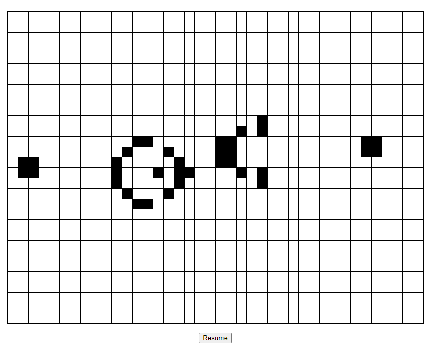
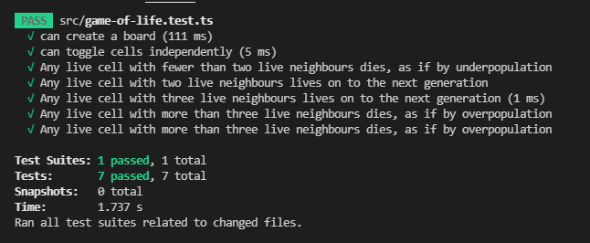

# Conway's Game of Life

Read carefully!

This repository contains an incomplete implementation of the famous Game Of Life, if you are not familiar with it you can take a look at:
- [This explanatory video](https://www.youtube.com/watch?v=OWXD_wJxCKQ)
- [It's wikipedia page](https://en.wikipedia.org/wiki/Conway%27s_Game_of_Life) 

## Objective
Your job is to finish the implementation while following the coding style and conventions of the existing code base. The objective is to expose you to the code-review process so you get familiar with it, hopefully it will also give you many good ideas about how to implement a bug-free board-based game in the future.

## Final result 


## IMPORTANT NOTES:

This project is written in React.JS with typescript but you don't really need to know it, your job is to create a bug-free module called ``game-of-life.ts`` that exposes the needed functions for:

- creating a board
- calculating the next generation
- toggling cells (alive/dead)

due to the way React works, you have to implement your module in an [**immutable**](https://web.mit.edu/6.005/www/fa15/classes/09-immutability/) fashion,  every function must be [**pure**](https://en.wikipedia.org/wiki/Pure_function#:~:text=In%20computer%20programming%2C%20a%20pure,reference%20arguments%20or%20input%20streams). and must return a copy (with changes) of the board received as parameter.

Example:

```typescript
 const oldBoard = createBoard(50, 30)
 // (setup initial state...)
 const newBoard = nextGenerationOf(oldBoard);
```

## Instructions

1.- Install [Node.JS](https://nodejs.org/es/) and [Git](https://git-scm.com/book/en/v2/Getting-Started-Installing-Git)  
2.- Clone the repository

```
git clone https://github.com/digital-vault-studio/training-game-of-life-public.git
```
3.- Go to the project directory and Install dependencies:

```
cd training-game-of-life
npm install
```

4.- Run the unit tests

```
npm run test
# then press 'a' to run all tests.
```

5.- Note there are 3 tests and they are all failing

```
Test Suites: 1 failed, 1 total
Tests:       3 failed, 3 total
Snapshots:   0 total
Time:        1.232 s
Ran all test suites.
```

6.- Fix them :)

Without touching the test file of course!. Notice how the 1st test suggests there must be a function called ``createBoard`` that returns a matrix of bools, but if you go to the function definition it's not doing anything.

7.- Add the missing tests and the implementation counterpart until you can ensure the game of life is complete and correct.

I strongly recommend you using the following workflow:

- step 1: write a failing test (it's a way of designing how your code will be used from outside)
- step 2: write the production code that fixes that test
- step 3: refactor your code, make it cleaner
- step 4: go to step 1 and repeat until the requirements are met

Remember, you are not finished until the test suite output is the following (and the code is clean enough)



Enjoy the final result with:
```
npm run start
```
